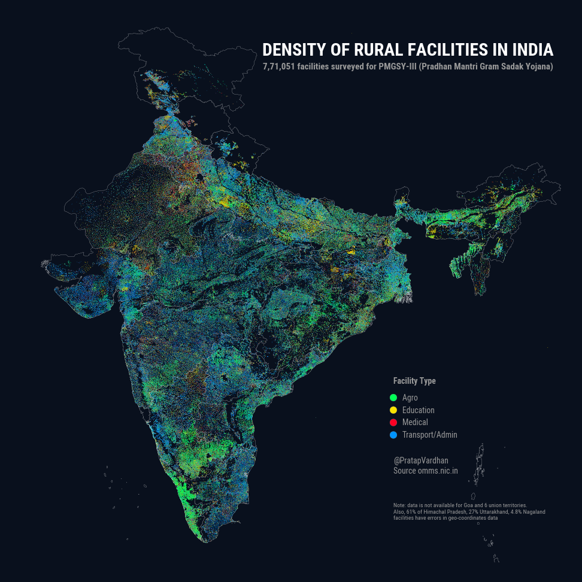

# Rural facilities geo-tagged dataset (PMGSY)

PMGSY (Pradhan Mantri Gram Sadak Yojana) released ~7,70,000 geo-tagged rural facilities data on it's portal omms.nic.in

- **License**: Government Open Data License - India (GODL).
- **Citation**: PMGSY Rural Facilities Dataset, Ministry of Rural Development 2020 http://omms.nic.in
---
- This repo contains cleaned csv files for individual state.
- Combined India dataset (120MB) is available on [Kaggle](https://www.kaggle.com/pratapvardhan/770k-geotagged-rural-facilities-in-india-pmgsy)
- Last updated on 27th November 2020. When possible please refer to original source (as data could update)

[Visuals](./share/) are shared under [Creative Commons Attribution 4.0 International](https://creativecommons.org/licenses/by/4.0/) (CC BY 4.0) license.

<blockquote class="twitter-tweet">
PMGSY recently released ~7,70,000 geo-tagged rural facilities data on it&#39;s portal. This map shows the density across India colored by category type (Agro, Education, Medical, Transport/Admin).  &#39;Glow&#39; signifies concentration. Read the thread for details. Caveats below. 1/n <a href="https://t.co/occs2fRvcf">pic.twitter.com/occs2fRvcf</a>
&mdash; Pratap Vardhan (@PratapVardhan) <a href="https://twitter.com/PratapVardhan/status/1332174593877020673?ref_src=twsrc%5Etfw">November 27, 2020</a></blockquote>

Columns include

- State
- District
- Block
- Habitation Name
- Habitation ID
- Facility Name
- Address
- File Upload Date
- Facility Category
- Facility Subcategory
- Lattitude
- Longitude